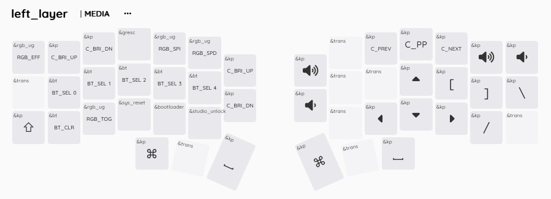

# Tan ZMK Firmware for Corne Choc Pro BT





## ✅ Flash Order (do this first to avoid mistakes!)

Get the desire Firmware from the [Pipeline Artifacts](https://github.com/TanZng/zmk-config/actions/workflows/build.yml).

1. Flash settings_reset.uf2 to both sides

2. Then flash nice_view.uf2:
    - First to the left side
    - Then to the right side

## 🔍 Check that the keyboard is detected:
```sh
diskutil list
```
Look for something like KEEBART or nRF UF2, usually /dev/disk4.

## 🚀 Flash the firmware:
```sh
sudo dd if=~/Downloads/firmware/${FIRMWARE} of=/dev/disk4 bs=1m status=progress
```

Replace ${FIRMWARE} with the .uf2 file you wanna flash.
